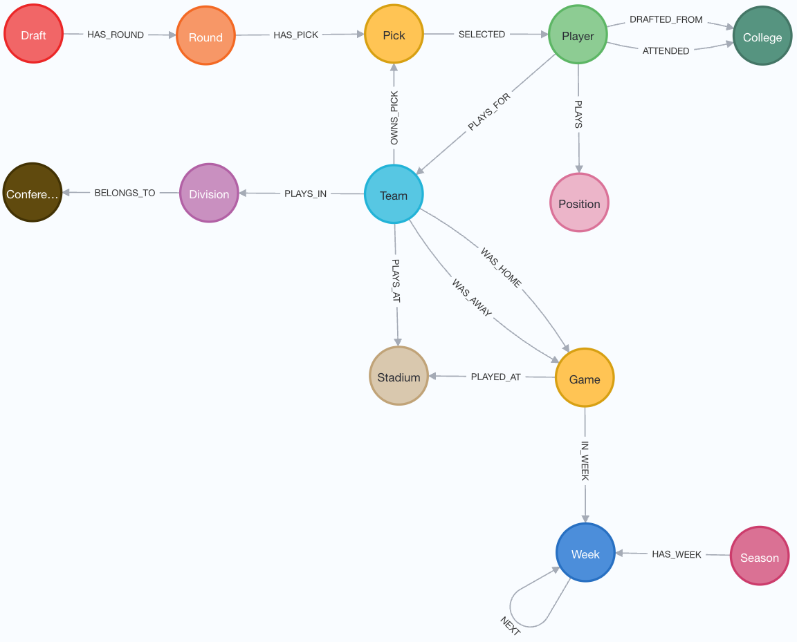

# 2024 NFL Team Info



## Setup 

### Create a venv
```
python -m venv nfl
pip install -r requirements.txt
```

### Run the Docker image
```
docker compose up -d
```

### Setup .env
Create a `.env` file at the root of the project. It should look something like below.
```
NEO4J_URI=neo4j://localhost
NEO4J_USER=neo4j
NEO4J_PASSWORD=YOUR_PASSWORD
```

### Call the importer
```
python importer.py 
```

### View in neo4j
1. Connect to your instance (defaults to http://localhost:7474/browser/
1. Run some queries!


## Example Queries

### Get the metadata
```
CALL db.schema.visualization();
```

### Get all data
```
MATCH (n) RETURN n;
```

### Get all players from Alabama on either the Packers or Lions
```
MATCH (lions:Team {id: 'detroit_lions'})<-[:PLAYS_FOR]-(lionsPlayer:Player)
MATCH (lionsPlayer)-[:ATTENDED]->(college:College {name: 'Alabama'})
MATCH (college)<-[:ATTENDED]-(packersPlayer:Player)
MATCH (packersPlayer)-[:PLAYS_FOR]->(packers:Team {id: 'green_bay_packers'})
RETURN lionsPlayer, packersPlayer, college, lions, packers;
```

### Identify Most Popular College for a Team
```
MATCH (t:Team)-[:PLAYS_FOR]-(p:Player)-[:ATTENDED]->(c:College)
WITH t, c, COUNT(p) AS player_count
ORDER BY player_count DESC
WITH t, COLLECT({college: c.name, count: player_count}) AS colleges
RETURN t.name AS team, HEAD(colleges).college AS top_college, HEAD(colleges).count AS player_count;
```

### Identify Most Popular College for a Team
```
MATCH (t:Team)-[:PLAYS_FOR]-(p:Player)-[:ATTENDED]->(c:College)
WITH t, c, COUNT(p) AS player_count
ORDER BY player_count DESC
WITH t, COLLECT({college: c, count: player_count}) AS colleges
WITH t, HEAD(colleges) AS top_college
MATCH (c:College {name: top_college.college.name})
MERGE (t)-[f:FAVORS]->(c)
SET f.count = top_college.count
RETURN t, c, f;
```

### Identify Most Popular College for a Division
```
MATCH (d:Division)<-[:PLAYS_IN]-(t:Team)-[:PLAYS_FOR]-(p:Player)-[:ATTENDED]->(c:College)
WITH d, c, COUNT(p) AS player_count
ORDER BY player_count DESC
WITH d, COLLECT({college: c, count: player_count}) AS colleges
WITH d, HEAD(colleges) AS top_college
MATCH (c:College {name: top_college.college.name})
MERGE (d)-[f:FAVORS]->(c)
SET f.count = top_college.count
RETURN d, c, f;
```


## Downloading New Data
This is currently pulling data from Pro Football Reference which has a rate limit of no more than 20 requests per minute. This downloader should remain within these boundaries aiming for 16 per minute. All data for the 2024 season is already available via the `rawdata` folder. To get other seasons, update `download_season.py` with the appropriate year. Note that there are currently a number of bugs that will require manually correcting the results.
1. Playoff weeks are non-numerical and must be replaced with the week number.
1. The `games.csv` files will be missing headers and must be updated to be `Week,Day,Date,Time,,Win/Loss,OT,Rec,Location,Opp,ScoreTm,ScoreOpp,1stD,TotYd,PassY,RushY,TO,1stD,TotYd,PassY,RushY,TO,Offense,Defense,Sp. Tms`